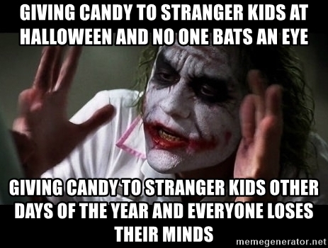

## Have you ever stop for a second to ponder how strange Halloween is?

First of all, no one sat in a dungeon and decided for all of western civilization to start dressing their kids as monsters and sending them from door to door to be "treated well with candies...or else!". All the while adults are decorating their homes with scary "gargoyles" made of pumpkins, mock dead bodies, and ghosts. 

All of that...very normal right?

My point is that a lot of people participate in this strange ritual "religiously" every year yet very few stop to think about what it means.

## The Symbolism of Halloween

As Jordan Peterson said it best in one of his videos: 

Archetype = Drama + Representation

**Halloween is an archetype.** Halloween is a pattern of reality. Whether you are okay with it or not, it's will show itself one way or another. It's not an arbitrary event.

The Carnaval of Halloween is a representation of reality that we reenact liturgically even though we may have lost its meaning. It's more than just "fun"... it's a big deal. The first question I heard when our prime minister announced that we would go on lockdown, because of the second wave of COVID, was: "Will it cancel Halloween?"

It's not a holiday(holy-day) we are culturally ready to let go anytime soon. 

We are attached to it because deep down we know there is something there. Just like the Christmas tree with its lights and the star at the top...we may not know "why" it's there, but we know it "just feels right". Those symbols remain long after people lost their ability to understand them. They are waiting to be heard. They are an echo of long lost wisdom.

## Halloween is a question

The question that Halloween brings to the forefront is this: 

"What should we do with our demons, misfits and monsters? How do we deal with the margins of ourselves, our misdirected desires, our addictions and crooked ways in general? 

### Trick or treat?

Should we chase them away? Well, that can be dangerous because they may come back with more strength than at the first encounter. 

Just like those who impose on themselves, through sheer force of will, extreme diets...only for them to swing back into a food binge. Or when a society tries to chase away the margins of society...only to get a revolution on their hands...or a second world war.

We cannot, for very long, chase away the margins. Pushing them further and further away from us. **They will always be there lurking.** We will always have passions and disordered desires at the edge of ourselves...just like we will always have monsters and misfits in our society. 

Jesus warns of chasing away demons in the parable of the strong man:

> “When an unclean spirit goes out of a man, he goes through dry places, seeking rest; and finding none, he says, ‘I will return to my house from which I came.’ And when he comes, he finds it swept and put in order. Then he goes and takes with him seven other spirits more wicked than himself, and they enter and dwell there; and the last state of that man is worse than the first.”

### Should we just give in then?

So what if we just let them in? What if we just submit to all our desires and passions? What if we let the margins of society live in people's houses or take over the government? That's not an option either.

### Should we just placate them instead?

So what about just feed or **treat** the demons so they go away, only for a moment? That seems better than the other options at least for a while...but the problem is that this might actually give them an incentive to came back for more...and they do. You might turn this one-time demand into addictions.

Just like the impulse for one more cigarette or that impulse to watch porn. Over time, that demand being granted grows into full-blown addictions that render you powerless.

You can do that until those demons have so much power that they own the place and want to bring it down. Until you become an addict. Talk to someone who is an alcoholic anonymous and they will tell you. They became, over time, servants of their passions and they found themselves powerless against them.

You see, this is the pattern of reality that we deal with **every single day of our lives.** We have desires for things we know are bad for us...but we do it anyway because the alternative isn't much better.

## If Halloween is the question, what is the answer?

Liturgically, the church has offered the answer: **prayer**. More specifically, a day of prayer called All Saints Day on the very next day. But that answer is there every single moment we have to deal with our passions.

The first 2 steps of AA is a great example of this:

1. Admit that you are powerless against your addiction (your demons).
2. Believe that a Power greater than yourself can restore you to sanity.

So when fighting the demons with your own strength or placating them isn't the answer, you have to submit to a higher power to do the job in you. 

This is foolishness to the world yet thousands upon thousands of addicts find solace and recovery in that realization. That higher power, in His character, is very "Jesus-y" in the AA format. Because he goes all the way down to the margin and in his mercy gives comfort and grace...bringing people back from the dead, leading them to new life. 

AA's know they are powerless against their addictions and demons **unless** they let go of their illusion of control. 

> “I am the way, and the truth, and the life.

Without Christ and the feast of all Saints Day, Halloween is a question without an answer...one that seems hopeless.

All Saints Day is a day where we remember that no shadow can overcome the light. This is the day where we celebrate the fact that Jesus Christ and all those who dwell with Him are alive. Death has been defeated. There is a path to Life in a world that seems filled with death.

Halloween is the day where Christians laugh at the power of death, for it has long been defeated.

"Oh death, where is your sting?"



## Credits

Photo by <a href="https://unsplash.com/@andyoneru?utm_source=unsplash&amp;utm_medium=referral&amp;utm_content=creditCopyText">Andyone</a> on <a href="https://unsplash.com/s/photos/halloween?utm_source=unsplash&amp;utm_medium=referral&amp;utm_content=creditCopyText">Unsplash</a>