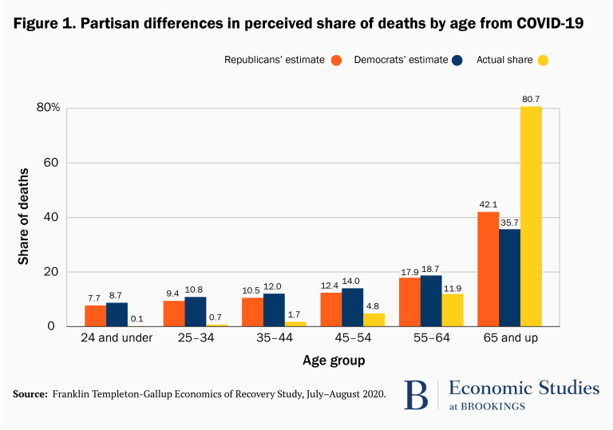

## Introduction
This week, my province has announced that [it will be implementing vaccination passports](https://montreal.ctvnews.ca/quebec-to-implement-vaccine-passport-due-to-rising-covid-19-cases-premier-says-1.5535639).  From what the polls are saying, it seems to be a popular position culturally. Afterall, those who have had the vaccine shots feel like they deserve to be treated differently than those who, for a reason or another, decided to abstain. 

Under the rubric of "public safety" and "emergency measures", everyone had to sacrifice a lot in the past 18 months. People have been stretched to their limits and are now looking for any way possible to return to a semblance of "normality".

But what if we are sleepwalking into a "new normal" that nobody would want to live in? I'll hope that if you are "pro-passport" that you will give this article a fair hearing and at least acknowledge that it's not as simple as it seems.

But first, I will give the devil's its due and make the case FOR vaccine passports before making my case against it.

## The Case FOR Vaccine Passports
A *strawman* is a fallacious argument that distorts an opposing stance in order to make it easier to attack, while *iron anning* is to present the case of the opponent in it's best possible light. 

So there we go, before moving ahead, I'll present what I think are the best arguments of those who are for vaccine passports:

### Four Good Reasons For Vaccine Passports
1. Return to "normal" for vaccinated people
2. An incentive for increased vaccination rate
3. Potential reduction in transmission
4. Faster economic recovery

Please if you can think of another one, add it to the list in the comment box down below.

For those who have to "sacrificed" themselves and their time to get vaccinated, there is a sense of fairness that is being stroked. After all, why should those who have abstain have the same rights as those who are vaccinated? 

> "If we are still in this mess it's because of them!"
 some people think.

## The Case AGAINST Vaccine Passports
Let's say that I concede all of those points (even though I have serious doubts about #1 and #3) ... is the juice worth the squeeze? Are the benefits outweigh the costs?

The biggest challenge in making an argument *against* COVID passport is that most arguments *for* are quite pragmatic and emotionally attractive for a vaccinated person. The arguments against are of a different nature... they are mostly of a *moral* and *ethical* nature.

But here are my main points of argument:
1. We are turning rights into privileges based on medical records
2. People overestimate the dangers associated with COVID
3. The dangers of the passports becoming permanent

### Rights Are Turning Into Privileges Granted By The State

One of the weaknesses of democracy is that it can easily devolve into "the tyranny of the majority".  This is why most democracies have a "[Charter of rights and freedoms](https://www.canada.ca/en/canadian-heritage/services/how-rights-protected/guide-canadian-charter-rights-freedoms.html)". The majority is not always wrong, but if the majority start believing Canada should deport black people for being black, we have to have a way to stop the madness...hence legal guardrails to preserve the rights of minorities.

Those institutions are there to prevent the majority or the state to overstep their authority over fundamental human rights. And yet, in times of *real* or *perceived* crisis, those boundaries are crossed. 

Christian Dubé said it perfectly during the press conference on August 10th:
> We cannot, **for now**, prevent unvaccinated workers from going to work because "working" is a right protected by the Québec Labour Code.

Basically, it signals that your worker's rights are a "nice thing to have" but that they can be overturned for the sake of political expediency if the polls and the media are cheering hard enough.

The future we are about to create is a world where *some* have rights and *some* don't...depending on the status of their health record! 

It is a very dangerous ethical line to cross.

#### "But This Is A Public Health Crisis!"
Now, **we are in an extraordinary circumstance** and some will say that "for the sake of the greater good" we have to be willing to sacrifice our rights of bodily autonomy, movement and association. 

#### But is it really?

Many people have been watching the news and updates about coronavirus daily. As the Brookings institute highlighted in their survey, the media created a distorted view of the risks from COVID.

> When asked to estimate the share of deaths by age group, the average American dramatically overestimates the share of COVID-19 deaths from people aged 24 and younger, putting it around 8%, when in fact it was 0.1% through August and has remained close to that level since. Meanwhile the elderly,  those 65 and older, had accounted for 81% of deaths at the time of the survey (and 79% through November).
 
 

<cite>[Source: How misinformation is distorting COVID policies and behaviors](https://www.brookings.edu/research/how-misinformation-is-distorting-covid-policies-and-behaviors/) by the Brookings Institute</cite>

For most western countries, the average age of death from COVID is **higher than the average life expectancy**. One death out of a thousand was for someone under the age 24 years old.

#### But what about the old and vulnerable?

As of August 11 2021, those age 55 and above are vaccinated at a rate between 80% and %92. We can safely assume, at this point, that the unvaccinated in the "vulnerable age bracket" are there because of personal health choices (of which are there are many).  

<cite>[Source:  VaccinTrackerQC](https://vaccintrackerqc.ca/en/)</cite>

### Perpetual State of Crisis - Operation COVID-ZERO
In recap, if 92% of all the deaths caused by COVID were from people of age 55 and over AND that same population is vaccinated well above the 80% threshold...why are we still in a state of emergency? That's because...

#### We Have An Unattainable Objective
Here is our problem...we have never defined precisely what "victory" looks like.

The first time I started thinking about that was in July 2020, when all of a sudden, banners started coming out in the local CLSC and hospital saying: "Operation COVID-ZERO". Now that struck me as *odd* because that seemed like an impossible objective. Is that what it's going to take to declare victory?

**At what point can we declare that it is no longer an "emergency" and simply a sad reality that is here to stay? What is the respectable amount of risk we should be expected to live with?**

Right now, as long as there are some deaths and sad stories, a few concerned scientists on TV, and polls showing the support for the measures, it seems that ZERO is the objective that is set in place.

This point launch my argument to the next point...

## The Potential Permanence of the Vaccine Passports

Ask yourself: What if vaccine passports become permanent?

Once the institution of vaccine passports is in place, the temptation will be for it to become a permanent feature of society. Once we morally "cross the line", it's only a matter of time before vaccine passports become "normal".

After all, lots of people die every year from diseases that have a vaccine for it, our hospitals have to delay surgeries every year during flu season because it can't take the load. (We have a broken system, the flu or COVID isn't the root cause of that)

Add a few COVID variants, the need for booster doses [as the vaccine lose about %6 efficacy per month according to Pfizer](https://www.cnn.com/2021/07/28/health/pfizer-third-dose-data-bn/index.html):

> The data show that the vaccine’s efficacy peaked at more than 96% from a week to around two months after receiving a second dose of vaccine, and then appeared to gradually decline to 83.7% four to six months later, with an average decline of about 6% over the last two months.

<cite>[Source: CNN](https://www.cnn.com/2021/07/28/health/pfizer-third-dose-data-bn/index.html)</cite>

Add to that a few more vaccine-resistant variants, a bad flu season and "Voila!",  the vaccine passport is here to stay.

Once it's permanent, your rights are "given" to you based on your medical record. If that's not a terrifying prospect, I don't know what is! Can you imagine, 5 years from now, people lining up for their booster shots of COVID or flu, just so they can have a date at the movie or at the coffee shop?

Is that the kind of world you want to live in?